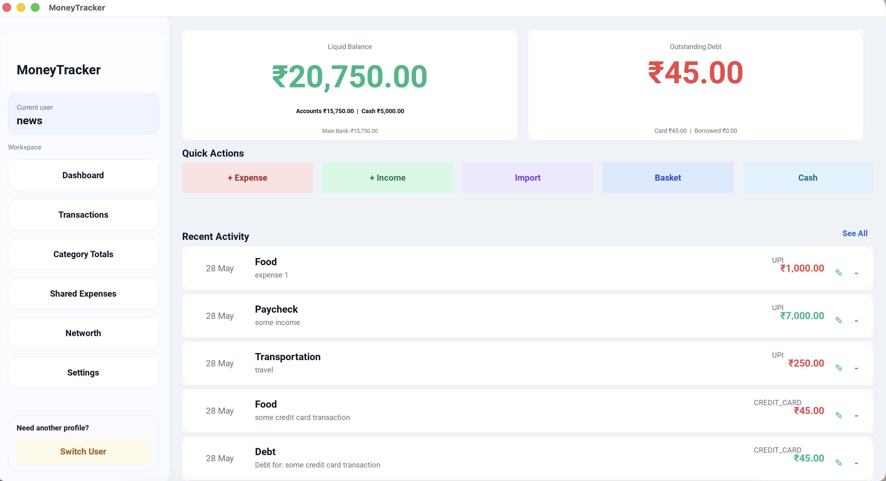
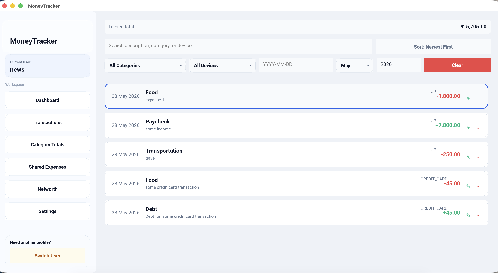
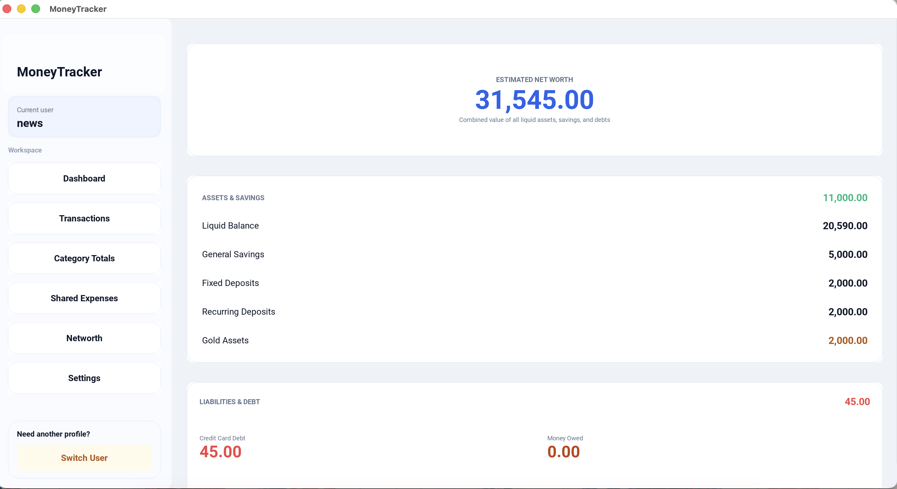
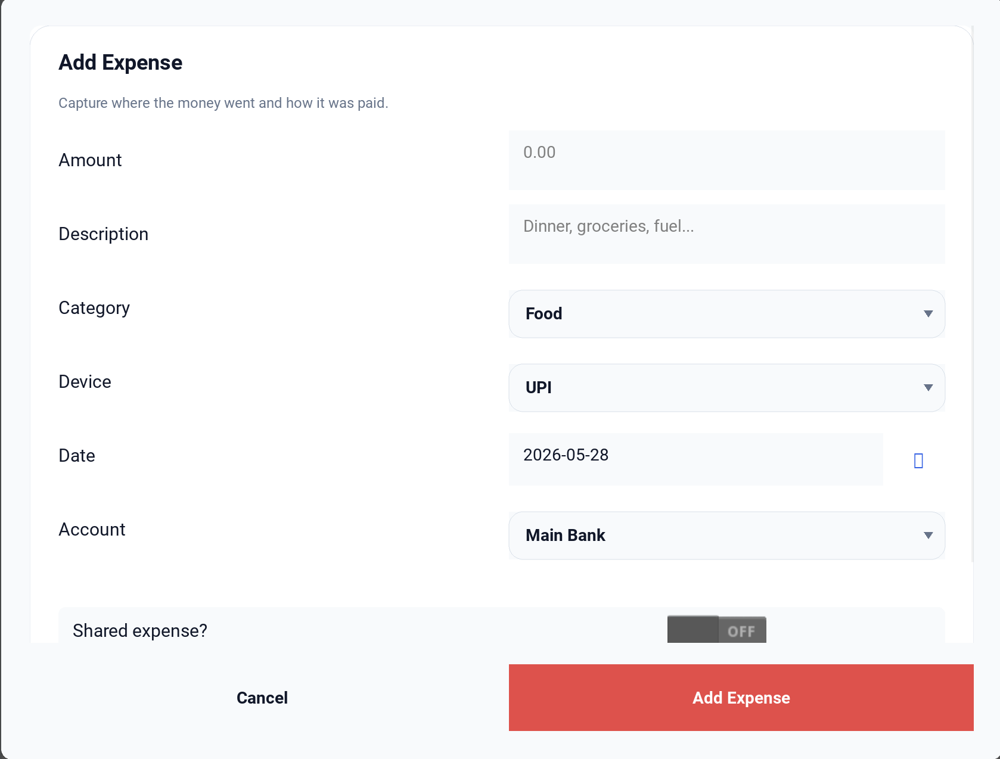
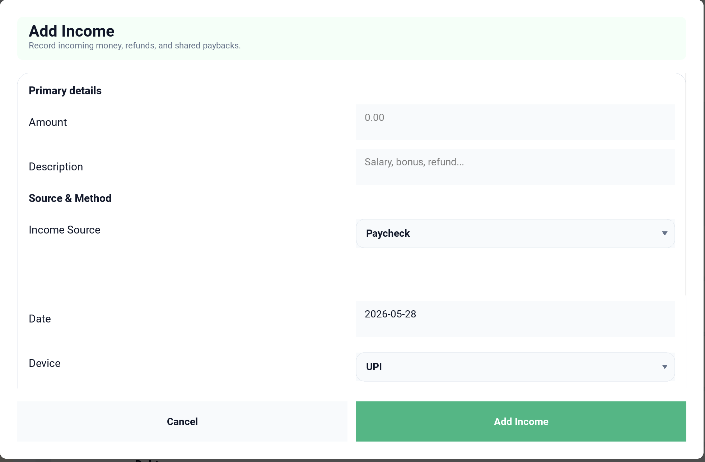
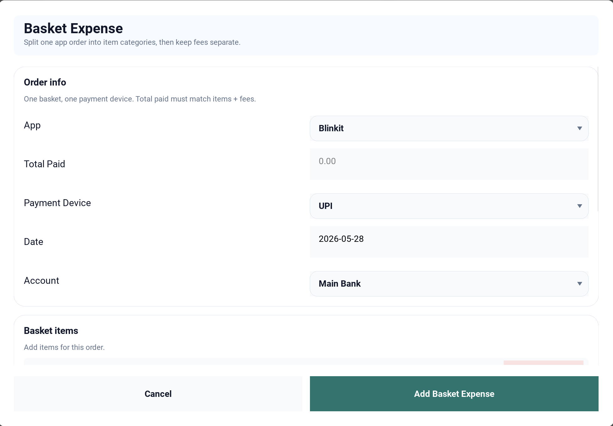

# Finance Tracker Web App

A comprehensive, private, and powerful personal finance management tool built with React, TypeScript, and Vite. Track your net worth, manage transactions, handle shared expenses, and sync everything securely with your own Google Sheets.

## 🚀 Key Features

- **Dashboard Overview:** Real-time summary of your liquid balance, bank balances, cash, savings, and total debt.
- **Transaction Management:** Detailed logging of expenses and income with support for categories, payment devices (UPI, Credit Cards, Cash), and locations.
- **Advanced Debt Tracking:** 
  - **Credit Card Logic:** Automatic billing cycle management (19th of month N to 18th of month N+1).
  - **Debt Pooling:** Payments are automatically applied to the oldest outstanding credit card expenses.
  - **Borrowed Debt:** Track personal loans and shared payables in one place.
- **Cloud Sync (Google Sheets):** Use your Google Sheets as a database. Push and pull data seamlessly to ensure your financial records are always backed up and accessible.
- **Shared Expenses & Splitting:** 
  - **Flexible Splitting:** Support for even splits or custom amount assignments among participants.
  - **Settlement Tracking:** Track who owes whom with an oldest-first settlement logic.
- **Net Worth Tracking:** Automated calculation of your total net worth by aggregating data from multiple accounts, fixed deposits (FD), recurring deposits (RD), gold, and other savings.
- **Category Totals:** Visualize your spending habits with category-wise breakdowns and budget tracking.
- **Privacy First:** Local-first architecture. Your data stays in your browser and your personal Google Drive.

## 📸 Screenshots

### Dashboard


### Transactions Ledger


### Category Analysis


### Shared Expenses & Splitting


### Net Worth Calculation


### Add Expense & Income
| Add Expense | Add Income |
| :---: | :---: |
|  |  |

### Basket Expenses (Multi-item)


### Settings & Customization
| Settings Main | Advanced Config |
| :---: | :---: |
|  |  |

## 🛠 Tech Stack


- **Frontend:** [React 19](https://react.dev/)
- **Language:** [TypeScript](https://www.typescriptlang.org/)
- **Build Tool:** [Vite](https://vitejs.dev/)
- **Routing:** [React Router 7](https://reactrouter.com/)
- **API Integration:** [Google Sheets API v4](https://developers.google.com/sheets/api)
- **State Management:** React Context API
- **Styling:** Vanilla CSS

## 🏁 Getting Started

### Prerequisites

- Node.js (Latest LTS recommended)
- A Google Cloud Project (for Google Sheets sync)

### Installation

1. **Clone the repository:**
   ```bash
   git clone https://github.com/your-username/finance-tracker-web-app.git
   cd finance-tracker-web-app
   ```

2. **Install dependencies:**
   ```bash
   npm install
   ```

3. **Start the development server:**
   ```bash
   npm run dev
   ```

4. **Configuration:**
   - Open the app in your browser (usually `http://localhost:5173`).
   - Navigate to **Settings**.
   - Paste your Google Spreadsheet URL to enable cloud sync.
   - Configure your bank accounts and categories as needed.

## 📂 Project Structure

```text
├── public/                # Static assets and icons
├── src/
│   ├── components/        # Reusable UI components (Modal, Layout, Sidebar)
│   ├── context/           # Auth and Finance state management
│   ├── pages/             # Page components (Dashboard, Transactions, etc.)
│   ├── services/          # API services (Google Sheets)
│   ├── types/             # TypeScript definitions
│   ├── utils/             # Helper functions and finance logic
│   ├── App.tsx            # Main application entry and routing
│   └── main.tsx           # React bootstrap
├── screenshots/           # Project preview images
└── package.json           # Dependencies and scripts
```

## 🔒 Security & Privacy

This application is designed with privacy in mind. Your financial data is stored locally in your browser's `LocalStorage` and optionally synced to **your own** private Google Spreadsheet. No third-party servers (other than Google) ever see your financial data.

---

Built with ❤️ by [Shashwat](https://github.com/shashwat)
